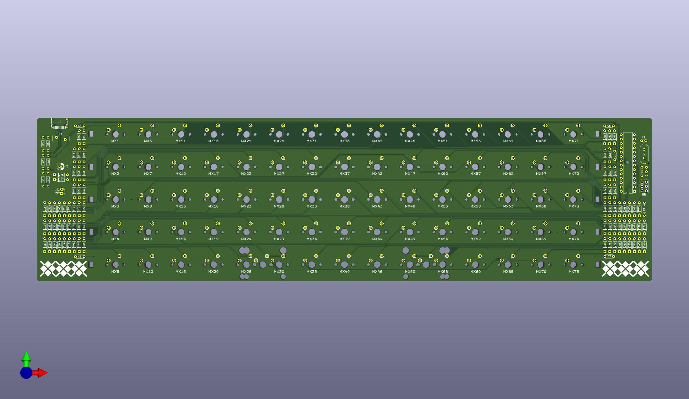
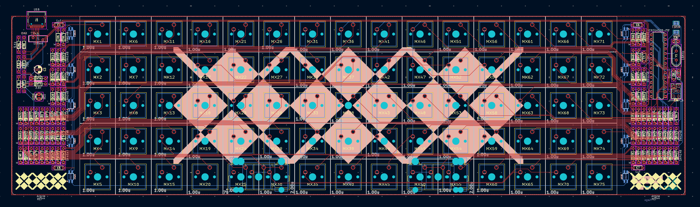

# Orthgyle - Ortholinear keyboard PCB for the Argyle

Orthgyle is a 5x15 ortholinear PCB using through-hole components for the [Argyle keyboard](https://geekhack.org/index.php?topic=116274).

* Designed to be a drop in replacement for the standard staggered Argyle PCB.
* Same Atmega283p MCU and side panel LEDs
* Uses a [Japanese Matrix](https://kbd.news/The-Japanese-duplex-matrix-1391.html) instead of an IO expander to simplify components and firmware.

